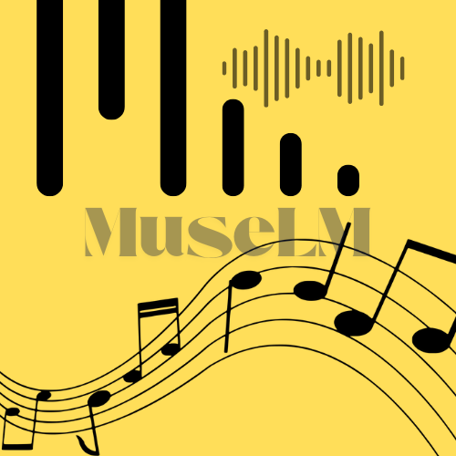
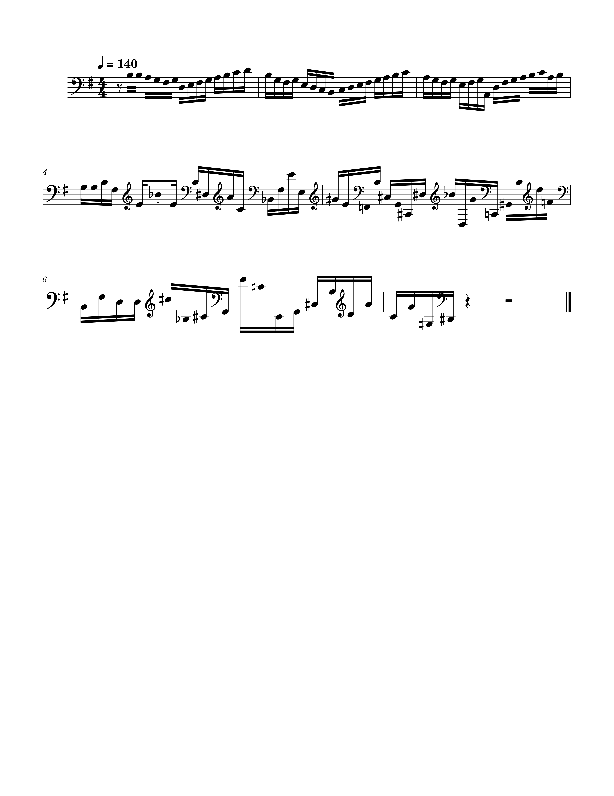

<div align="center">
  
  # 🎼 MuseLM 🎵 
  An LSTM-based Music Generation Model 🎹 trained on the **Bach Cello Suite Dataset** 🎻🎶.  
  Generate Music that sounds classical...🎼🤖
  <br> </br>
  


<!--  
[](https://pypistats.org/packages/supervision)
[](https://snyk.io/advisor/python/supervision)
[](https://github.com/roboflow/supervision/blob/main/LICENSE.md)
[](https://badge.fury.io/py/supervision)
[](https://colab.research.google.com/github/roboflow/supervision/blob/main/demo.ipynb)
[](https://huggingface.co/spaces/Roboflow/Annotators)
[](https://discord.gg/GbfgXGJ8Bk)
[](https://squidfunk.github.io/mkdocs-material/)
-->
[](https://www.linkedin.com/in/vishal35198/)

</div>


## 🎯 Project Goal

To build a music generation system that learns sequences of notes and durations from symbolic classical datasets (e.g., Bach Cello Suites) and produces expressive, playable MIDI outputs.

---
## 🎼 Note

This Project is my personal exploration to build a LSTM model to generate a simple melodies of classical era. I am a pianist and have keen intereset in generative models.

---
## 🎯 Example Score

Here's an example of the scoring output:




## 🔧 Features

- Built completely from scratch using PyTorch
- Trains on note-duration vocab pairs
- Dual-output LSTM: predicts next note and duration
- MIDI generation using Music21
- Custom dataset class and vocabulary handling
- Fully trainable, debuggable, and clean architecture

---

## 🗂️ Dataset

- [Bach Cello Suites - Symbolic MIDI Files](https://bach.duq.edu/midi/)
- Parsed using `music21`, chordified and cleaned
- Vocabularies built for both **notes** and **durations**

---

## 🧠 Model Architecture

- Embedding Layer (for note and duration)
- LSTM layers
- Dual linear heads: one for notes, one for durations
- Cross-entropy loss used for both outputs

---

---

## 🎼 Generate MIDI

```bash
python generate.py
```

Outputs a MIDI file based on the trained model. Playback supported via any MIDI software or Music21.

---

## 📈 Sample Output

*Coming Soon – Once model completes training fully on Bach dataset*

---


## 📜 License

Apache License

---

## 📫 Contact

Feel free to reach out if you're passionate about AI + Music:
**Email**: [vishal@example.com](mailto:vishal@example.com)
**LinkedIn**: \[YourProfileHere]

````

---


</div>
